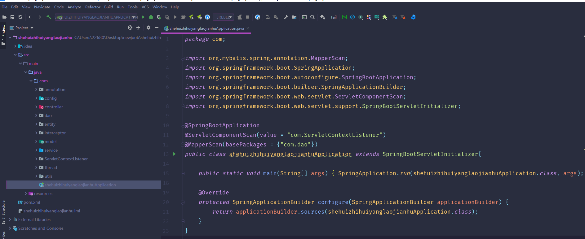
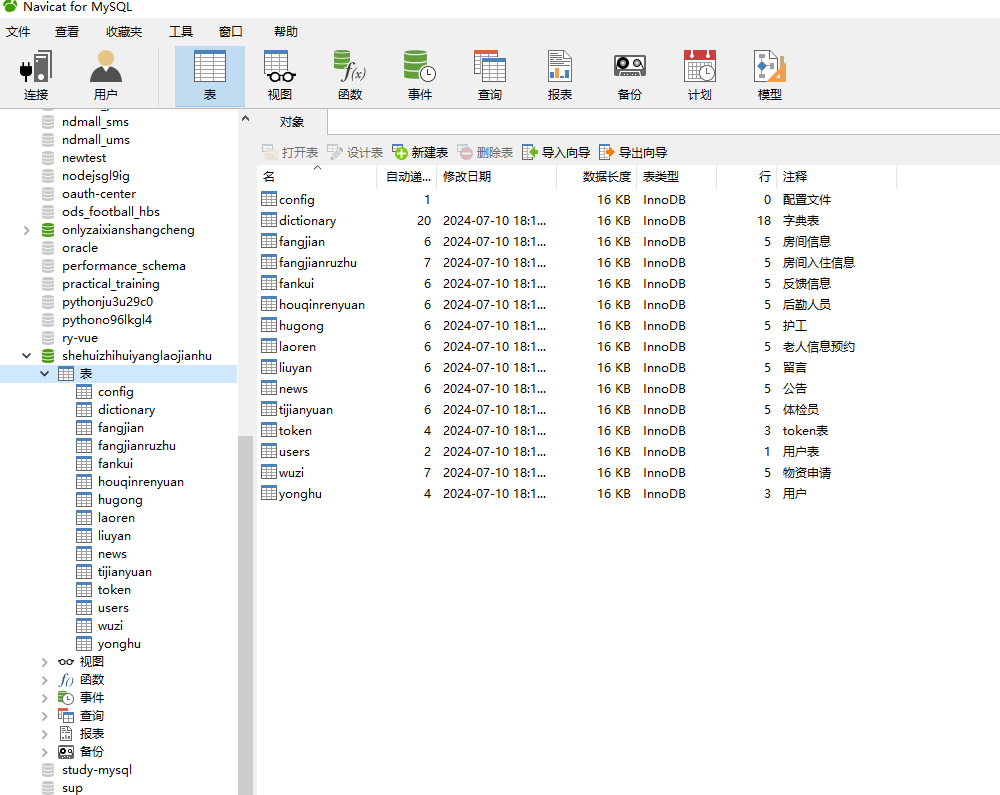
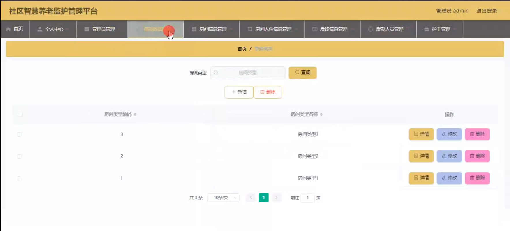
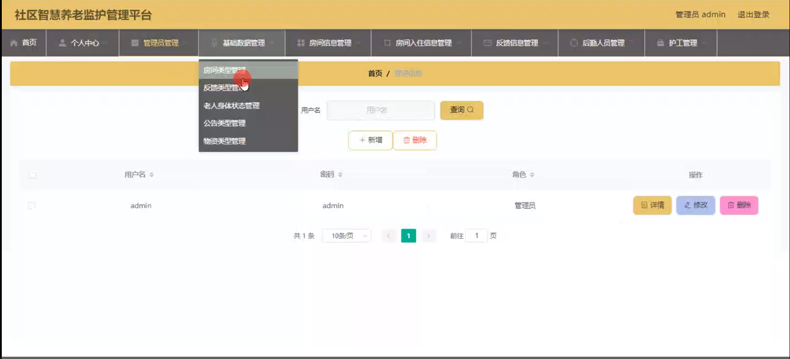
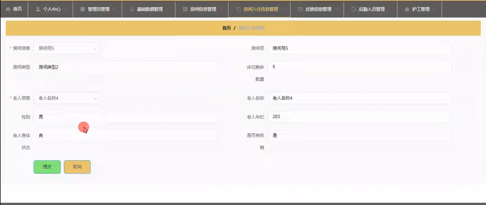
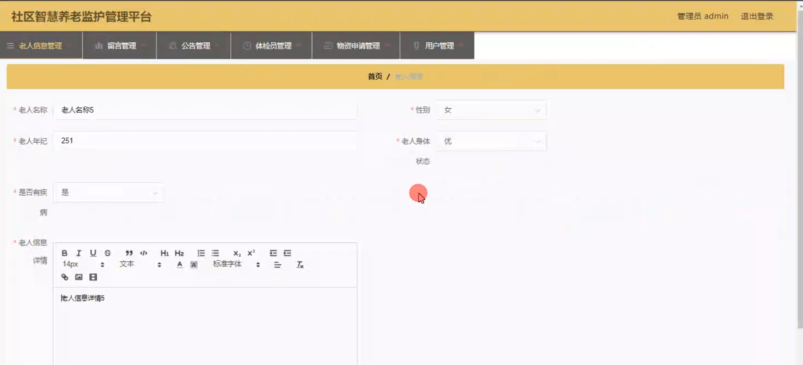
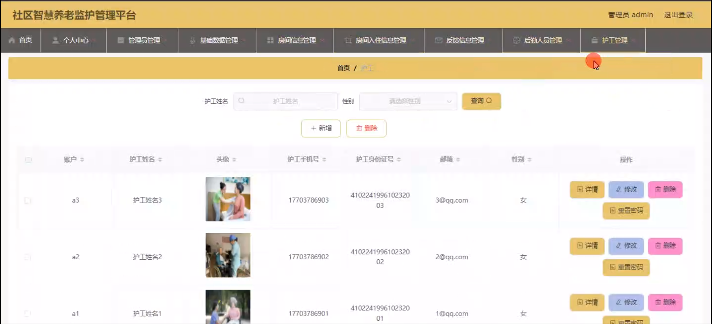
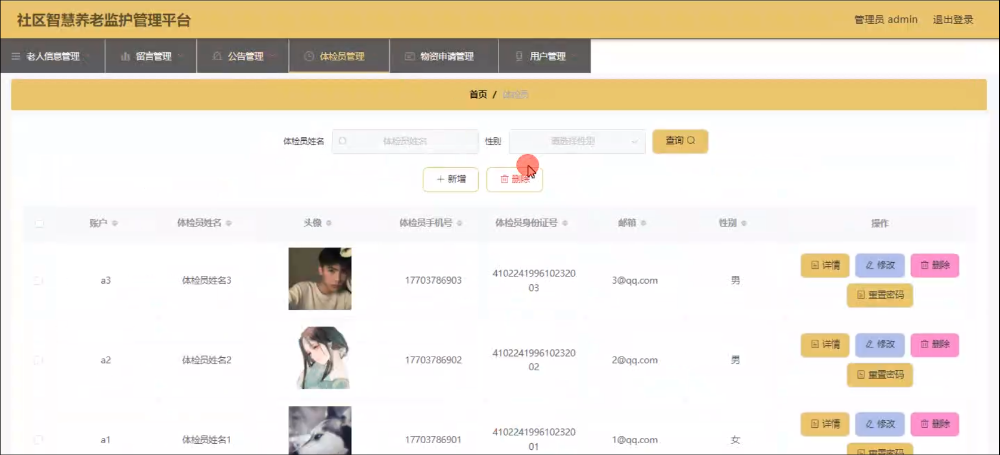
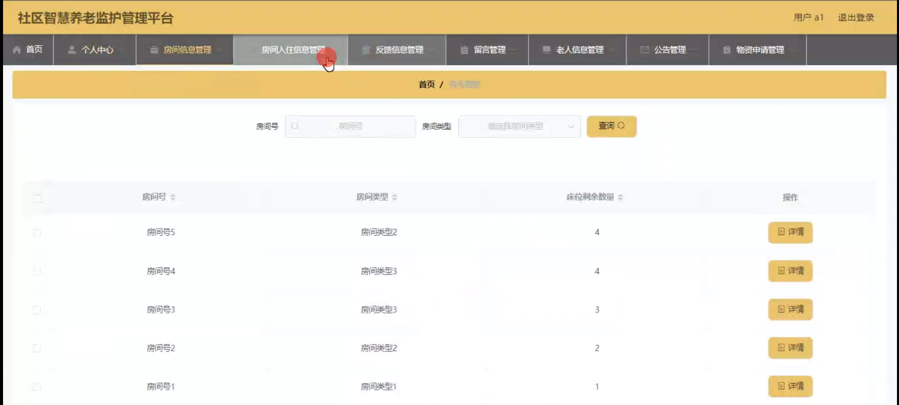
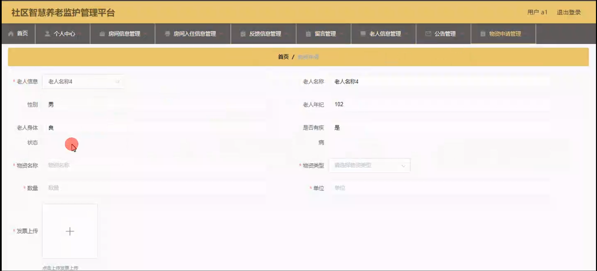

# 基于springboot的社区智慧养老监护管理平台

---
### 👉作者QQ ：1556708905 微信：zheng0123Long (支持定制修改、部署调试、定制毕设)

### 👉接网站建设、小程序、H5、APP、各种系统等

---

#### 介绍

随着人口老龄化的加剧，养老服务的需求日益增长，传统的养老模式已经难以满足现代社会的需求。为了提供更高效、便捷、个性化的养老服务，我们开发了这个基于 Spring Boot 的社区智慧养老监护管理平台。该平台旨在整合社区养老资源，实现对老年人的全面监护和管理，提升养老服务的质量和水平。

#### 技术栈

后端技术栈：Springboot+Mysql+Maven

前端技术栈：Vue+Html+Css+Javascript+ElementUI

开发工具：Idea+Vscode+Navicate

#### 系统功能介绍

（一）管理员角色  
个人中心：管理员在此可以查看和修改个人信息，接收系统通知和重要消息。  
管理员管理：对其他管理员进行添加、删除、权限设置等操作，确保管理团队的合理配置和分工。  
基础数据管理：维护系统所需的基础数据，如老人健康指标范围、服务项目分类、收费标准等。  
房间信息管理：全面管理社区养老房间的信息，包括房间位置、面积、设施配备等。  
房间入住信息管理：记录老人的入住时间、房间分配、费用缴纳情况等。  
反馈信息管理：收集和处理来自老人、家属及护工等的反馈，及时解决问题和改进服务。  
后勤人员管理：对后勤人员的信息进行登记、排班、工作考核等管理。  
护工管理：负责护工的招聘、培训、工作安排和绩效评估。  
老人信息管理：详细记录老人的个人基本信息、健康状况、家属联系方式等。  
留言管理：查看和回复老人及家属的留言，保持良好的沟通。  
公告管理：发布社区养老的相关通知、活动安排、政策变化等公告。  
体检员管理：对体检员的工作进行安排和监督，确保老人体检的顺利进行。  
物资申请管理：审批护工、后勤等人员的物资申请，保障物资的合理供应。  
用户管理：对使用该平台的用户进行注册审核、权限设置、信息修改等操作。  

（二）用户角色
个人中心：用户可以修改个人资料、查看系统通知和自己的操作记录。  
房间信息管理：查询社区养老房间的详细信息，为老人选择合适的房间。  
房间入住信息管理：了解房间的入住状态和相关费用信息。  
反馈信息管理：提交对社区养老服务的意见和建议。  
留言管理：向管理员或其他相关人员留言，咨询问题或表达需求。  
老人信息管理：查看所负责老人的详细信息，及时更新和关注老人的状态。  
公告管理：获取社区养老的最新公告和通知。  
物资申请管理：根据工作需要申请相关物资。  

#### 系统作用

提高管理效率  
实现养老服务的信息化管理，减少人工操作和繁琐流程，提高工作效率。  
优化服务质量  
通过及时处理反馈信息和合理安排人员物资，为老人提供更贴心、优质的服务。  
增强安全性    
准确掌握老人的信息和健康状况，能够在紧急情况下迅速做出响应。  
促进资源合理分配  
有效管理房间、人员和物资等资源，避免浪费和不足。  
提升老人及家属满意度  
提供便捷的沟通渠道和透明的服务信息，增强老人和家属对养老服务的信任和满意度。  

#### 系统功能截图

代码结构

数据库表

登录

房间类型管理

管理员管理

房间入住信息管理

老人信息管理

护工管理

体验员管理

用户端房间管理

物资申请管理

#### 总结

基于 Spring Boot 的社区智慧养老监护管理平台，通过明确的角色分工和丰富的功能模块，实现了社区养老服务的数字化、智能化管理。管理员能够全面掌控养老服务的各个环节，用户能够便捷地获取所需信息和服务。该平台有助于提升社区养老服务的品质，为老年人创造更舒适、安全、幸福的晚年生活。

#### 使用说明

创建数据库，执行数据库脚本 修改jdbc数据库连接参数 下载安装maven依赖jar 启动idea中的springboot项目

后台登录页面
http://localhost:8080/shehuizhihuiyanglaojianhu/admin/dist/index.html

管理员				账户:admin 		密码：admin